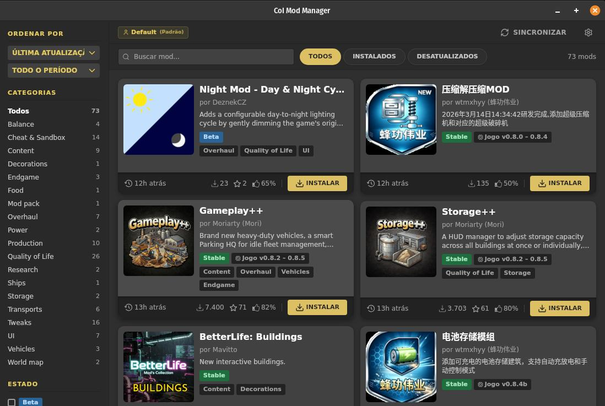
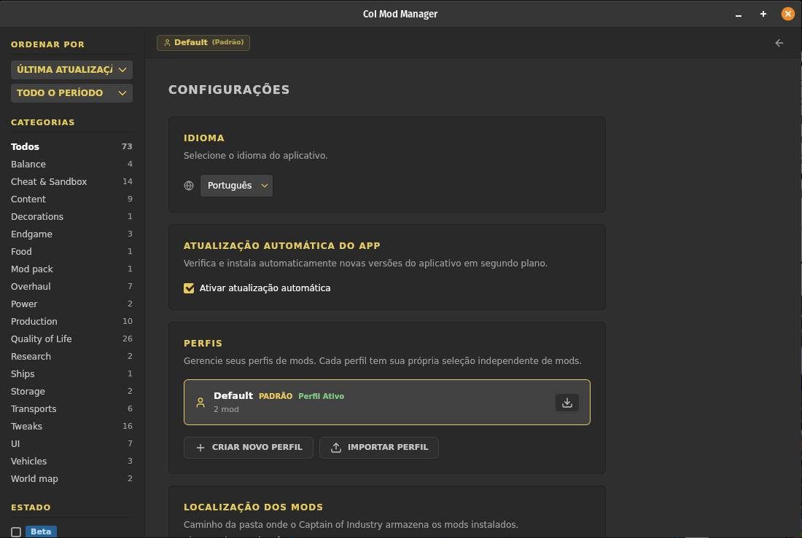

[English](#-coi-mod-manager) · [Português](#-coi-mod-manager-1) · [Español](#-coi-mod-manager-2)

---

# 🎮 CoI Mod Manager

> **Browse, install, and manage Captain of Industry mods — all from one place.**

[](https://github.com/fabioivan/coi-mod-manager/releases)
[](LICENSE)
[](https://v2.tauri.app)

A desktop app that scrapes [hub.coigame.com](https://hub.coigame.com), lets you install/update/uninstall mods locally, and organizes everything into **profiles** — so you can switch between mod setups without re-downloading.

---

## ✨ Features

- **🔍 Browse & Search** — Scrape the entire mod hub. Filter by tags, game version, dev state, and sort by popularity or date.
- **⬇️ Install / Update / Uninstall** — One-click operations. ZIPs are downloaded and extracted directly into your mods folder.
- **👥 Profile System** — Create isolated mod profiles (e.g. vanilla+, overhaul, testing). Switch between them instantly. Mods stay cached in a local pool.
- **🗺️ Maps** — Browse, search, and download community maps. Rate and favorite with your COI Hub account.
- **🔷 Blueprints** — Browse and search blueprints. Copy blueprint strings with one click.
- **🔐 COI Hub Login** — Sign in to your COI Hub account to vote and favorite maps directly from the app.
- **🔄 Auto-Update** — Checks for new app versions on startup and installs automatically (configurable in Settings).
- **🌐 Multi-language** — English, Português (Brasil), Italiano, and 中文 (简体).
- **⚡ Fast & Native** — Built with Tauri v2 (React 19 + Rust). No Electron overhead.

---

## 📸 Screenshots





---

## 🚀 Quick Start

1. **Install** — Download the latest release from [Releases](https://github.com/fabioivan/coi-mod-manager/releases)
2. **Configure** — Open the app, go to **Settings**, and set your **Mods folder** (where Captain of Industry expects mods, usually `CoI/Mods`)
3. **Sync** — Click **Sync** on the top bar to fetch the mod list from the hub
4. **Install** — Browse mods and click **Install** on any mod you want

---

## 👥 Profiles

| Step | Action |
|------|--------|
| 1 | Go to **Settings → Profiles** |
| 2 | **Create** a profile and give it a name |
| 3 | Switch to it — mods installed from now on belong to this profile |
| 4 | **Switch** between profiles to change your active mod set |
| 5 | **Export** to share or back up; **Import** to restore |

Profiles share a common download pool — switching is instant and doesn't re-download anything.

---

## 🔄 Updates

| Type | How |
|------|-----|
| **Mod updates** | Click **Update all** on the top bar, or update individual mods from their cards |
| **App updates** | On startup, the app checks for new versions. Automatic installation can be toggled in **Settings → Auto Update** |

---

## 🔐 COI Hub Login

Sign in with your [COI Hub](https://hub.coigame.com) account to vote on maps and mark favorites.

> ⚠️ **Important:** You can only be logged into one place at a time. If you are signed into the COI Hub website, you must sign out there first before signing in through the app.

### How to Sign In

| Step | Action |
|------|--------|
| 1 | Click **Sign In** in the top bar |
| 2 | Click **Open COI Hub Login** — the login page opens in your browser |
| 3 | Enter your email on the COI Hub site and submit — you'll receive a magic link |
| 4 | Copy the magic link from your email and paste it into the app dialog |
| 5 | Click **Go** — you're signed in! |

Once signed in, you can upvote/downvote maps and add them to your favorites directly from the map detail page.

### Sign Out

Click **Sign Out** in the top bar to clear your session.

---

## 🛠️ Development

```sh
npm install                    # Install frontend dependencies
npm run tauri dev              # Full Tauri dev (Vite + Rust)
npm run dev                    # Vite frontend only (port 1420)
npm run build                  # tsc type-check + Vite build
cargo check                    # Rust compile check (in src-tauri/)
cargo test                     # Rust unit tests (in src-tauri/)
```

---

## 📦 Building a Release

```sh
./scripts/release.sh <version|patch|minor|major>
```

This bumps `package.json` + `tauri.conf.json`, commits, tags `vX.Y.Z`, and pushes. Push triggers the [GitHub Release workflow](.github/workflows/release.yml), which builds binaries and publishes via `tauri-plugin-updater`.

---

## 🧱 Tech Stack

| Layer | Technology |
|-------|-----------|
| **Frontend** | React 19, TypeScript, Vite, Tailwind CSS v4, i18next |
| **Backend** | Rust, Tauri v2, rusqlite (bundled SQLite), scraper/html5ever, reqwest, zip |
| **Packaging** | Tauri v2 bundler (`.msi`, `.AppImage`, `.deb`) + `tauri-plugin-updater` |

---

## 📄 License

MIT. See [LICENSE](LICENSE).

*Captain of Industry, MaFi Games, and related trademarks are the property of MaFi Games. This project is not affiliated with or endorsed by MaFi Games.*

---

[English](#-coi-mod-manager) · [Português](#-coi-mod-manager-1) · [Español](#-coi-mod-manager-2)

---

# 🎮 CoI Mod Manager

> **Navegue, instale e gerencie mods do Captain of Industry — tudo em um só lugar.**

[](https://github.com/fabioivan/coi-mod-manager/releases)
[](LICENSE)
[](https://v2.tauri.app)

Um aplicativo desktop que busca mods do [hub.coigame.com](https://hub.coigame.com), permite instalar/atualizar/desinstalar localmente e organiza tudo em **perfis** — para alternar entre conjuntos de mods sem baixar novamente.

---

## ✨ Funcionalidades

- **🔍 Navegar & Pesquisar** — Busque todo o hub de mods. Filtre por tags, versão do jogo, estado de desenvolvimento e ordene por popularidade ou data.
- **⬇️ Instalar / Atualizar / Desinstalar** — Operações com um clique. ZIPs são baixados e extraídos diretamente na pasta de mods.
- **👥 Sistema de Perfis** — Crie perfis de mods isolados (ex.: vanilla+, overhaul, testes). Alterne entre eles instantaneamente. Mods ficam em cache num pool local.
- **🗺️ Mapas** — Navegue, pesquise e baixe mapas da comunidade. Avalie e favorite com sua conta do COI Hub.
- **🔷 Blueprints** — Navegue e pesquise blueprints. Copie strings de blueprint com um clique.
- **🔐 Login COI Hub** — Faça login na sua conta do COI Hub para votar e favoritar mapas diretamente do app.
- **🔄 Atualização Automática** — Verifica novas versões do app na inicialização e instala automaticamente (configurável em Configurações).
- **🌐 Multi-idioma** — Inglês, Português (Brasil), Italiano e 中文 (简体).
- **⚡ Rápido & Nativo** — Construído com Tauri v2 (React 19 + Rust). Sem overhead de Electron.

---

## 📸 Capturas de Tela


---

## 🚀 Início Rápido

1. **Instale** — Baixe o release mais recente em [Releases](https://github.com/fabioivan/coi-mod-manager/releases)
2. **Configure** — Abra o app, vá em **Configurações** e defina a **Pasta de mods** (onde o Captain of Industry espera os mods, geralmente `CoI/Mods`)
3. **Sincronize** — Clique em **Sincronizar** na barra superior para buscar a lista de mods do hub
4. **Instale** — Navegue pelos mods e clique em **Instalar** no mod desejado

---

## 👥 Perfis

| Passo | Ação |
|-------|------|
| 1 | Vá em **Configurações → Perfis** |
| 2 | **Crie** um perfil e dê um nome a ele |
| 3 | Alterne para ele — mods instalados a partir de agora pertencem a este perfil |
| 4 | **Alternne** entre perfis para mudar o conjunto ativo de mods |
| 5 | **Exporte** para compartilhar ou fazer backup; **Importe** para restaurar |

Perfis compartilham um pool comum de downloads — a troca é instantânea e não baixa nada novamente.

---

## 🔄 Atualizações

| Tipo | Como |
|------|------|
| **Atualizações de mods** | Clique em **Atualizar tudo** na barra superior, ou atualize mods individualmente pelos cards |
| **Atualizações do app** | Na inicialização, o app verifica novas versões. A instalação automática pode ser configurada em **Configurações → Auto Update** |

---

## 🔐 Login COI Hub

Faça login com sua conta do [COI Hub](https://hub.coigame.com) para votar em mapas e marcar favoritos.

> ⚠️ **Importante:** Você só pode estar logado em um lugar por vez. Se estiver logado no site do COI Hub, faça logout lá primeiro antes de fazer login pelo app.

### Como Fazer Login

| Passo | Ação |
|-------|------|
| 1 | Clique em **Sign In** na barra superior |
| 2 | Clique em **Open COI Hub Login** — a página de login abre no seu navegador |
| 3 | Digite seu email no site do COI Hub e envie — você receberá um magic link |
| 4 | Copie o magic link do seu email e cole na janela do app |
| 5 | Clique em **Go** — você está logado! |

Depois de logado, você pode votar (positivo/negativo) e favoritar mapas diretamente da página de detalhes do mapa.

### Sair

Clique em **Sign Out** na barra superior para limpar sua sessão.

---

## 🛠️ Desenvolvimento

```sh
npm install                    # Instalar dependências do frontend
npm run tauri dev              # Desenvolvimento Tauri completo (Vite + Rust)
npm run dev                    # Apenas frontend Vite (porta 1420)
npm run build                  # tsc type-check + build Vite
cargo check                    # Verificação de compilação Rust (em src-tauri/)
cargo test                     # Testes unitários Rust (em src-tauri/)
```

---

## 📦 Criando um Release

```sh
./scripts/release.sh <version|patch|minor|major>
```

Isso incrementa a versão em `package.json` + `tauri.conf.json`, commita, cria a tag `vX.Y.Z` e faz push. O push dispara o [workflow de Release do GitHub](.github/workflows/release.yml), que compila os binários e publica via `tauri-plugin-updater`.

---

## 🧱 Stack Tecnológica

| Camada | Tecnologia |
|--------|-----------|
| **Frontend** | React 19, TypeScript, Vite, Tailwind CSS v4, i18next |
| **Backend** | Rust, Tauri v2, rusqlite (SQLite embutido), scraper/html5ever, reqwest, zip |
| **Empacotamento** | Tauri v2 bundler (`.msi`, `.AppImage`, `.deb`) + `tauri-plugin-updater` |

---

## 📄 Licença

MIT. Veja [LICENSE](LICENSE).

*Captain of Industry, MaFi Games e marcas relacionadas são propriedade da MaFi Games. Este projeto não é afiliado ou endossado pela MaFi Games.*

---

[English](#-coi-mod-manager) · [Português](#-coi-mod-manager-1) · [Español](#-coi-mod-manager-2)

---

# 🎮 CoI Mod Manager

> **Explore, instale y administre mods de Captain of Industry — todo en un solo lugar.**

[](https://github.com/fabioivan/coi-mod-manager/releases)
[](LICENSE)
[](https://v2.tauri.app)

Una aplicación de escritorio que obtiene mods del [hub.coigame.com](https://hub.coigame.com), permite instalar/actualizar/desinstalar localmente y organiza todo en **perfiles** — para cambiar entre conjuntos de mods sin descargar de nuevo.

---

## ✨ Características

- **🔍 Explorar & Buscar** — Obtenga todo el hub de mods. Filtre por etiquetas, versión del juego, estado de desarrollo y ordene por popularidad o fecha.
- **⬇️ Instalar / Actualizar / Desinstalar** — Operaciones con un clic. Los ZIP se descargan y extraen directamente en la carpeta de mods.
- **👥 Sistema de Perfiles** — Cree perfiles de mods aislados (ej.: vanilla+, overhaul, pruebas). Cambie entre ellos al instante. Los mods se guardan en caché en un pool local.
- **🗺️ Mapas** — Explore, busque y descargue mapas de la comunidad. Califique y favoritee con su cuenta de COI Hub.
- **🔷 Blueprints** — Explore y busque blueprints. Copie cadenas de blueprint con un clic.
- **🔐 Inicio de Sesión COI Hub** — Inicie sesión en su cuenta de COI Hub para votar y favoritear mapas directamente desde la app.
- **🔄 Actualización Automática** — Comprueba nuevas versiones de la app al iniciar y las instala automáticamente (configurable en Configuración).
- **🌐 Multi-idioma** — Inglés, Portugués (Brasil), Italiano y 中文 (简体).
- **⚡ Rápido & Nativo** — Construido con Tauri v2 (React 19 + Rust). Sin sobrecarga de Electron.

---

## 📸 Capturas de Pantalla


---

## 🚀 Inicio Rápido

1. **Instale** — Descargue el último lanzamiento desde [Releases](https://github.com/fabioivan/coi-mod-manager/releases)
2. **Configure** — Abra la app, vaya a **Configuración** y defina la **Carpeta de mods** (donde Captain of Industry espera los mods, generalmente `CoI/Mods`)
3. **Sincronice** — Haga clic en **Sincronizar** en la barra superior para obtener la lista de mods del hub
4. **Instale** — Navegue por los mods y haga clic en **Instalar** en el mod deseado

---

## 👥 Perfiles

| Paso | Acción |
|------|--------|
| 1 | Vaya a **Configuración → Perfiles** |
| 2 | **Cree** un perfil y asígnele un nombre |
| 3 | Cambie a él — los mods instalados desde ahora pertenecen a este perfil |
| 4 | **Cambie** entre perfiles para modificar el conjunto activo de mods |
| 5 | **Exporte** para compartir o respaldar; **Importe** para restaurar |

Los perfiles comparten un pool común de descargas — el cambio es instantáneo y no descarga nada de nuevo.

---

## 🔄 Actualizaciones

| Tipo | Cómo |
|------|------|
| **Actualizaciones de mods** | Haga clic en **Actualizar todo** en la barra superior, o actualice mods individualmente desde sus tarjetas |
| **Actualizaciones de la app** | Al iniciar, la app comprueba nuevas versiones. La instalación automática se puede configurar en **Configuración → Auto Update** |

---

## 🔐 Inicio de Sesión COI Hub

Inicie sesión con su cuenta de [COI Hub](https://hub.coigame.com) para votar en mapas y marcar favoritos.

> ⚠️ **Importante:** Solo puede estar conectado en un lugar a la vez. Si ha iniciado sesión en el sitio web de COI Hub, debe cerrar sesión allí primero antes de iniciar sesión a través de la app.

### Cómo Iniciar Sesión

| Paso | Acción |
|------|--------|
| 1 | Haga clic en **Sign In** en la barra superior |
| 2 | Haga clic en **Open COI Hub Login** — la página de inicio de sesión se abre en su navegador |
| 3 | Ingrese su correo electrónico en el sitio de COI Hub y envíe — recibirá un magic link |
| 4 | Copie el magic link de su correo electrónico y péguelo en el diálogo de la app |
| 5 | Haga clic en **Go** — ¡ha iniciado sesión! |

Una vez conectado, puede votar (a favor/en contra) y agregar mapas a sus favoritos directamente desde la página de detalles del mapa.

### Cerrar Sesión

Haga clic en **Sign Out** en la barra superior para limpiar su sesión.

---

## 🛠️ Desarrollo

```sh
npm install                    # Instalar dependencias del frontend
npm run tauri dev              # Desarrollo Tauri completo (Vite + Rust)
npm run dev                    # Solo frontend Vite (puerto 1420)
npm run build                  # tsc type-check + build Vite
cargo check                    # Verificación de compilación Rust (en src-tauri/)
cargo test                     # Tests unitarios Rust (en src-tauri/)
```

---

## 📦 Creando un Release

```sh
./scripts/release.sh <version|patch|minor|major>
```

Esto incrementa la versión en `package.json` + `tauri.conf.json`, commitea, crea la etiqueta `vX.Y.Z` y hace push. El push dispara el [workflow de Release de GitHub](.github/workflows/release.yml), que compila los binarios y publica mediante `tauri-plugin-updater`.

---

## 🧱 Stack Tecnológico

| Capa | Tecnología |
|------|-----------|
| **Frontend** | React 19, TypeScript, Vite, Tailwind CSS v4, i18next |
| **Backend** | Rust, Tauri v2, rusqlite (SQLite embebido), scraper/html5ever, reqwest, zip |
| **Empaquetado** | Tauri v2 bundler (`.msi`, `.AppImage`, `.deb`) + `tauri-plugin-updater` |

---

## 📄 Licencia

MIT. Vea [LICENSE](LICENSE).

*Captain of Industry, MaFi Games y las marcas relacionadas son propiedad de MaFi Games. Este proyecto no está afiliado ni respaldado por MaFi Games.*
